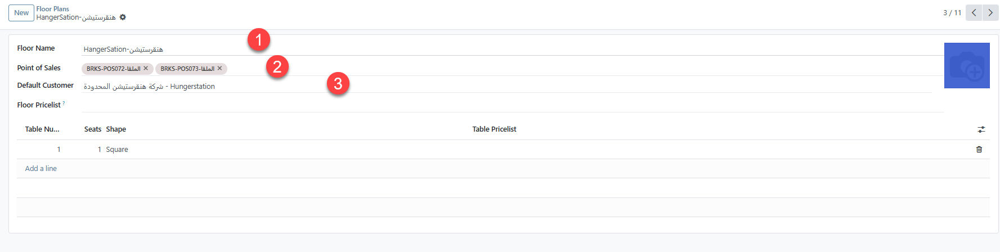

# إنشاء تطبيق توصيل Floor -App

> من قائمة Configuration 🡪 Floor Plans

1.  في حقل Floor Name ، اكتب اسم التطبيق

2.  في حقل Points of Sales يتم اختيار نقاط البيع المرتبطة
    بالتطبيق.

3.  في حقل Default Customer ، يتم اختيار اسم العميل (نقدي
    ، اسم التطبيق) المعرف سابقا في شاشة Partners

