**[انشاء نقطة بيع جديدة للفرع]** 

# Document Information:

  -----------------------------------------------------------------------
  **Document Title**   [انشاء نقطة بيع جديدة للفرع]
  -------------------- --------------------------------------------------
  **Document Type**    User Manual

  **Author**           so Vision Teams

  **Creation Date**    20/05/2025

  **Document Version** 1.0

  **System Version**   Odoo 18

  **Target Audience**  IT Admins

  **Document           POS-OD18-UG
  Reference**          

  **Document           001
  Sequence**           
  -----------------------------------------------------------------------

# Document History :

  ---------------------------------------------------------------------------
  **Ver**   **Date of        **Approved by**
            Approved**       
  --------- ---------------- ------------------------------------------------
  1.0                        

                             

                             

                             

                             

                             

                             

                             
  ---------------------------------------------------------------------------

**[إنشاء نقطة بيع للشركة]**

1.  [تأكد من الشركة التي تتبعها نقطة البيع الجديدة]

2.  [من القائمة الرئيسية، انتقل]Point of Sale 🡪 Configuration
    🡪 Point of Sale.

3.  [اضغط على **إنشاء**] **(Create)**.

4.  [أدخل اسم نقطة البيع
    (مثلاً:]BRKS-POS073-[الملقا)].

5.  [اضغط على] Setting [لتحديد باقي اعدادات نقطة نقاط
    البيع]

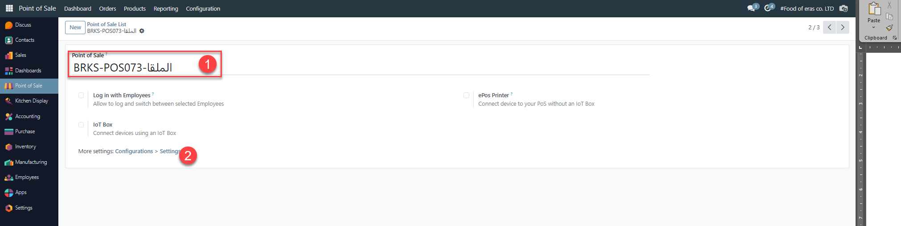

**[إعدادات نقطة البيع :]**

1.  [اختيار وضع المطعم] is a Bar/Restaurant

2.  [اختيار الجلسات] Floor [- والتي تمثل تطبيقات التوصيل
    المختلفة.]

**[تحديد طرق الدفع] (Payment Methods)**

1.  [في صفحة الاعداد نقطة البيع، انتقل إلى تبويب **الدفع**]
    **(Payments)**.

2.  [أضف طرق الدفع المناسبة (نقد، مدى، فيزا، أبل باي، الخ)].

3.  [بإمكانك إنشاء طريقة دفع جديدة من القائمة الجانبية عبر]
    **Configuration -\> Payment Methods** .

4.  [فعل اختيار] Automatically Validate order [، لتأكيد
    الاورد في نقطة البيع بمجرد تأكيد عميلة الدفع]

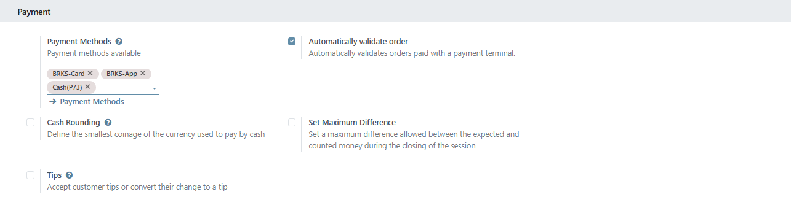

**[تحديد الموظفين] (Cashiers)[، والشعار]**

1.  [في البداية لابد من أن يكون هناك موظف معرف خاص بكل
    كاشير.]

2.  [حدد الموظفين الذين سيستخدمون نقطة البيع للكاشير
    والمشرف.]

3.  [فعل اختيار] Chane Logo [لتحديد شعار مخصص لنقطة
    البيع]

> [اختار الصورة الخاصة بالشعار لنقطة البيع]

4.  [فعل اختيار] Restrict Product Merge [، لفصل الإضافات على
    كل سطر في طلبيات البيع ، وطلب المطبخ]

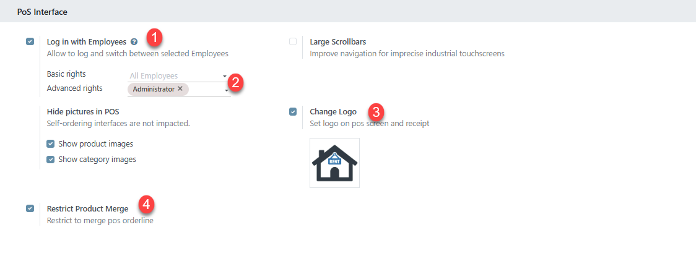

**[إضافة مركز التكلفة ، والترقيم]**

1.  POS Analytic Tags [:]

> [حدد مركز التكلفة التي تم انشاء من المالية لنقطة البيع ، اذا لم يكن
> هناك مركز تكلفة مناسب لنقطة البيع يجب انشاء من المالية
> أولاً.]

2.  [ادخل الرقم المناسب لبدء التسلسل الخاص بعمليات البيع في نقطة البيع
    والتي يتم بدء منه في كل مرة يتم فتح جلسة بيع جديدة.]

**[تحديد فئات المنتجات المرتبطة بنقاط البيع :] Product & POS
Categories**

1.  [فعل الاختيار] Restrict Categories []

2.  [اختيار فئات المنتجات] Pos Categories [الخاص بالفرع والتي
    تحدد المنتجات التي سيتم بيعها في نقاط البيع]

[(اذا لم يتم تحديد فئة منتجات لن تظهر منتجات في نقاط البيع)]

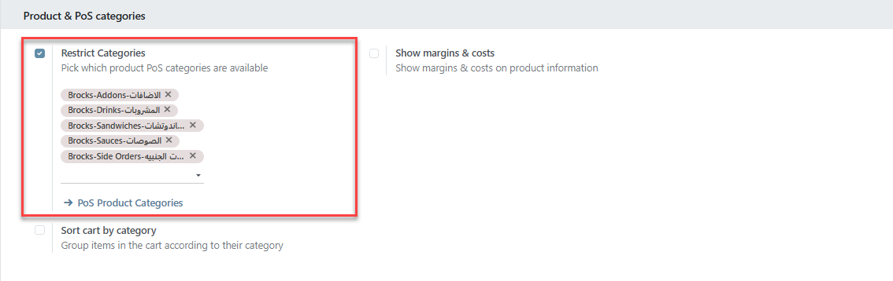

**[الضرائب] Tax**

1.  [تأكد من اعداد الضرائب والقيمة المضافة المعرفة على الشركة وتحديدها
    في نقاط البيع]

2.  [تأكد من يوميات البيع لنقطة البيع والمعرفة على الشركة]

3.  [تأكد من يوميات الفواتير المعرفة لنقاط البيع]

> [**ملحوظة** : اذا كانت هناك يوميات مختلفة يجب مراجعة المالية لإنشاء
> اليوميات المناسبة للفرع]

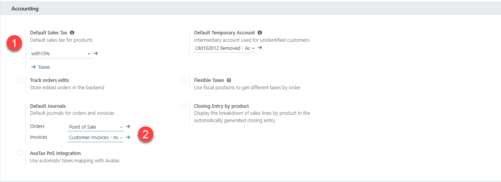

**[قائمة الأسعار :]**

1.  [فعل اختيار] Flexible Price List

2.  [حدد قائمة الأسعار الذي سيتم التعامل معها في نقطة البيع]

3.  [حدد قائمة الأسعار الأساسية] Default [المستخدمة لنقطة
    البيع (البيع المحلي)]

4.  [حدد احتساب الضرائب (السعر شامل القيمة المضافة)]
    Tax-included Price

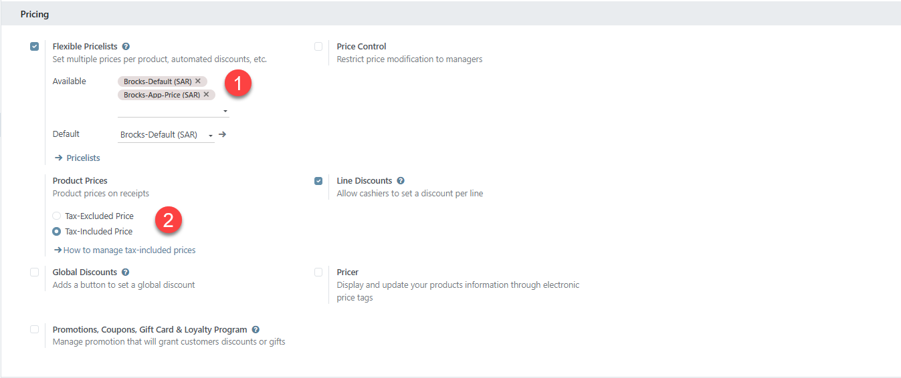

**[اعداد الطباعة للإيصالات] Bills & Receipts[:]**

1.  [حدد اختيار] Custom Header & Footer [، لإضافة نصوص تظهر
    في رأس وتزيل الفاتورة المطبوعة]

2.  [حدد اختيار الطباعة التلقائية] Automatic Receipt Printing
    [، ذلك للطباعة التلقائية للفاتورة بمجرد تأكيد عملية الدفع
    .]

**[إضافة طابعة الكاشير ، وطباعة المطبخ]**

1.  [فعل اختيار] ePos Printer [لطابعة الكاشير]

2.  [ادخل رقم الـ] ip [الخاص بالطباعة مباشرة]

3.  [حدد اختيار طباعة إيصال المطبخ]

4.  [اختيار الاختيار] Automatically After Validator [للطباعة
    إيصال المطبخ تلقائي مع طباعة فاتورة العميل\
    ]

5.  [في تبويب] Preparation [: فعل اختيار]
    Preparation Printer

6.  [يتم اختيار طابعات المطبخ المعرفة سابقا من شاشة]
    Orders🡪Preparation Printers

7.  [من خانة] internal notes [: اختار الملاحظات الجاهزة
    المراد إظهارها في نقطة البيع]

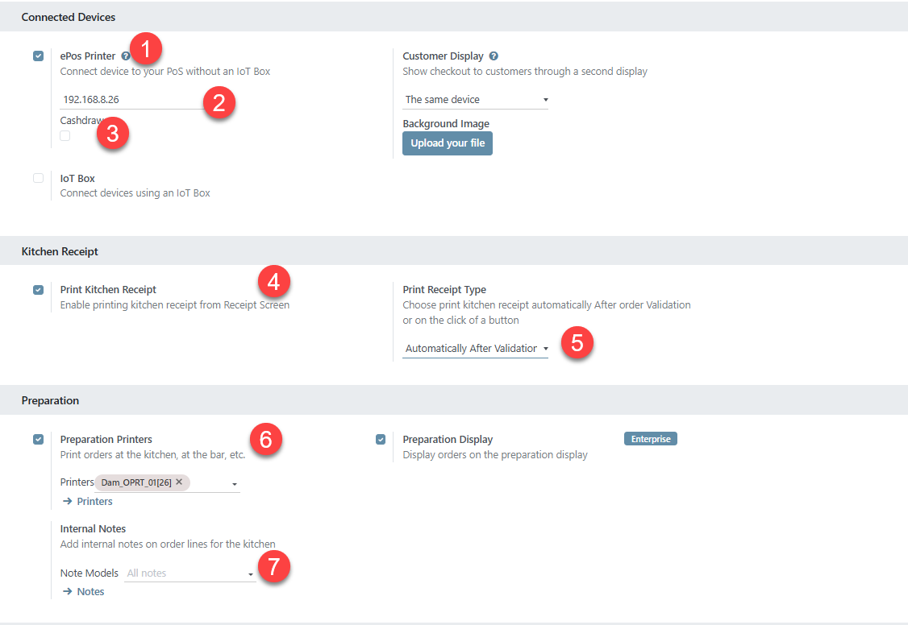

**[تحديد المخزن المرتبط بنقطة البيع]**

[من التبويب] inventory [قم باختيار] Operation Type
[الخاص بنقطة البيع والمعرفة مسابقة من إدارة المخازن]

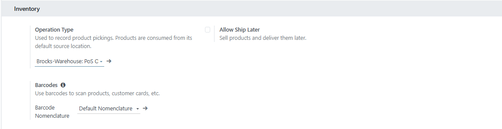

**[إنشاء تطبيق توصيل] Floor -App**

> [من قائمة] Configuration 🡪 Floor Plans

1.  [في حقل] Floor Name [، اكتب اسم التطبيق]

2.  [في حقل] Points of Sales [يتم اختيار نقاط البيع المرتبطة
    بالتطبيق.]

3.  [في حقل] Default Customer [، يتم اختيار اسم العميل (نقدي
    ، اسم التطبيق) المعرف سابقا في شاشة] Partners

> 

**[إنشاء طريقة دفع] Payment Methods**

> 
> [أنواع طرق الدفع :\
> 1-] Cash [نقدي]
>
> [2- كارت/بنك] Card/Bank

3.  [تطبيق -] App

1.  **[تعريف النقدي --]** Cash

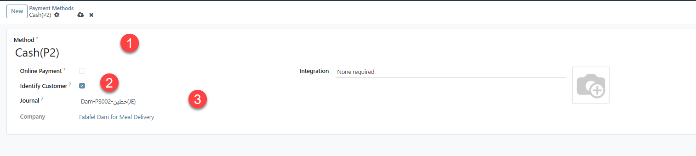

- [اسم طريقة الدفع]

- [اختيار الربط مع عميل]

- [اختيار يومية النقدية]

> [(ملحوظة : يوميات الدفع بالنقدية] cash [تكون وحيدة لكل نقطة
> بيع بمعنى لايمكن مشاركة يومية النقدية مع اكتر من نقطة بيع)]

- [يتم تعريف يومية البيع من اليوميات بالمالية وربطه بحساب النقدية في
  اعدادات الحسابات] Journal , Accounts []

> [اعدادات اليومية:]

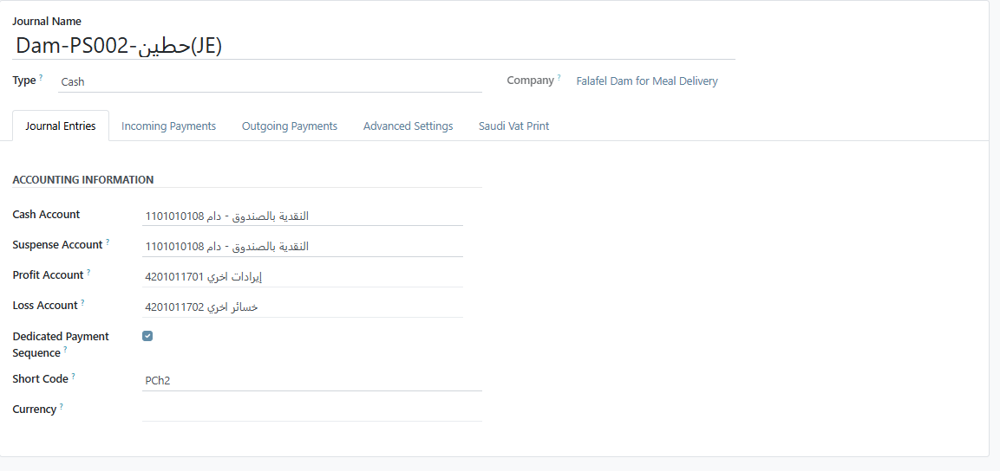

2.  **[الكارت / البنك --] Card / Bank**

- [اسم طريقة الدفع]

- [اختيار الربط مع عميل]

- [اختيار يومية البنك] Bank

> [ملحوظة : يومية البنك يتم تعريفها من المالية ، وربطها مع الحساب البنك
> الخاص بالشركة ، يمكن مشاركة طريقة الدفع على اكثر من نقطة بيع بعكس
> طريقة (الدفع النقدي] cash[)]
>
> [اعدادات اليومية:]

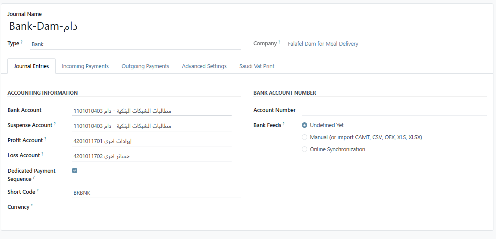

3.  **[الدفع بالتطبيق --] App**

- [اسك طريقة الدفع]

- [اختيار الربط مع عميل]

- [اختيار يومية تطبيقات التوصيل]

> *[ملحوظة: يتم تعريف اليومية من المالية] Journal [، وربطها
> مع حساب] )[مطالبات التطبيقات ) المعرف في شجرة
> الحسابات]*
>
> **[اعدادات اليومية:]**

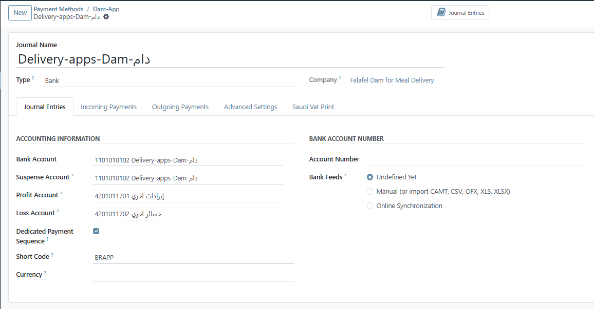
[\
]

**[إنشاء طابعة المطبخ :]**

**Orders 🡪 Preparation Printers**

1.  [ادخل اسم الطابعة]

2.  [اختار] use an Epson printer

3.  [ادخل عنوان] IP [الخاص بالطابعة]

4.  [إضافة فئات المنتجات المرتبطة بالطابعة] POS Category

[هذا الاختيار يقوم بتوجيه المنتجات المختارة في الطلب إلى الطابعة الخاصة
به مثل (العصائر ، الساندوتشات)]

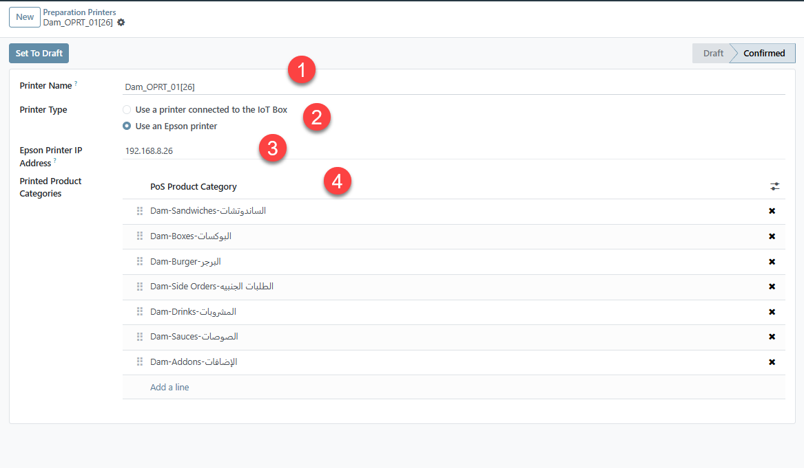
**[إنشاء وتعريف قائمة الأسعار] Price List**

**[من قائمة] Product 🡪 Price List**

1.  [اسم قائمة الأسعار المستخدمة]

2.  [العملة]

3.  [الشركة التابعة لها قائمة الاسعار (تأتي تلقائيا من الشركة النشطة
    )]

4.  [إضافة المنتج المراد تطبيق عليه قائمة الأسعار]

5.  [إضافة السعر الجديد للمنتج الخاص بقائمة الأسعار]

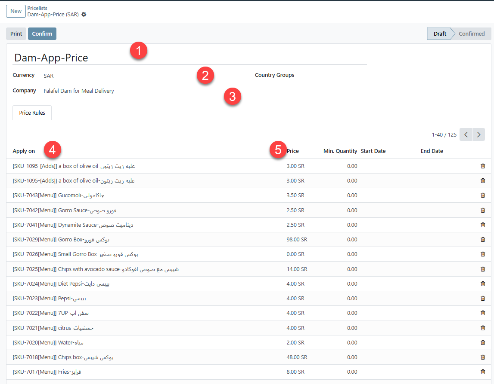

[يمكن معرفة أسعار المنتج على قوائم الأسعار المرتبط به من خلال شاشة
بيانات المنتج] Product [، واختيار التبويب الخاص بقائمة
الأسعار] Price List[.]

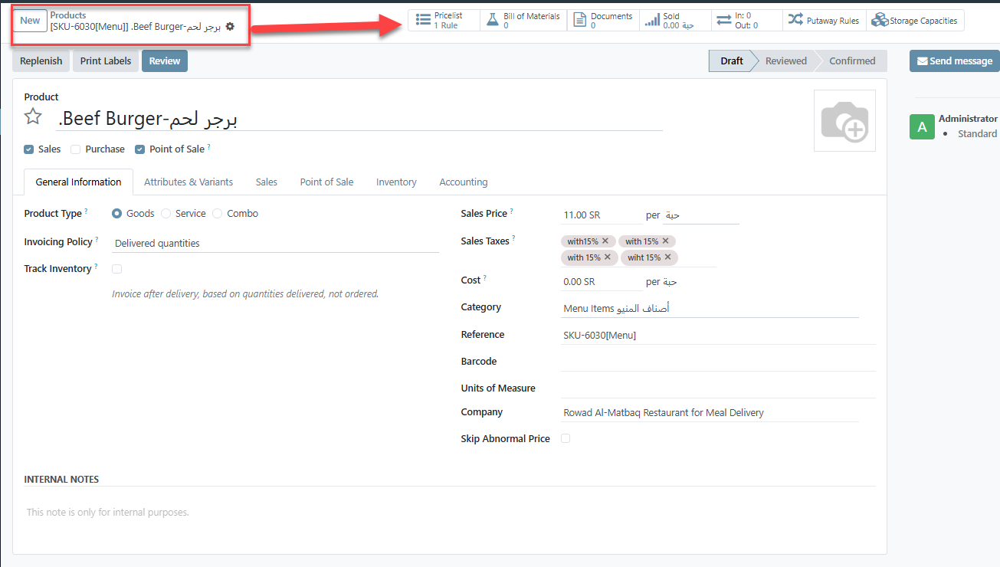

[\* كل شركة لها قائمة الأسعار الخاصة بها ، مع انشاء الشركة يتم انشاء
تلقائي قائمة أسعار افتراضية للشركة] Default Price List

[\* يتم إضافة قائمة الأسعار على العميل في شاشة] Contact
🡪Customer 🡪 Sale 🡪 (Price List)

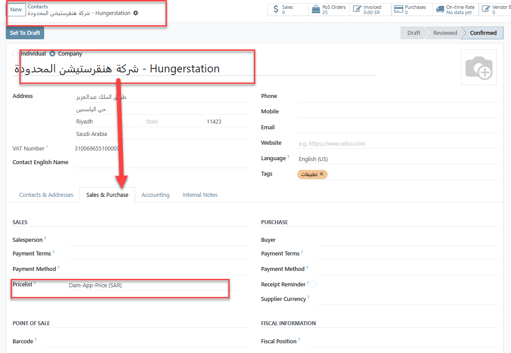

[\* اذا كان العميل مشترك لأكثر من شركة يجب اختيار الشركة واختيار قائمة
الأسعار الخاصة بالعميل لهذه الشركة]

