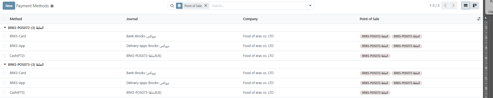

**إنشاء طريقة دفع Payment Methods**

> 
> أنواع طرق الدفع :\
> 1- Cash نقدي
>
> 2- كارت/بنك Card/Bank

3.  تطبيق - App

1.  **تعريف النقدي --** Cash

![image].(media/media/image14.png)

- اسم طريقة الدفع

- اختيار الربط مع عميل

- اختيار يومية النقدية

> (ملحوظة : يوميات الدفع بالنقدية cash تكون وحيدة لكل نقطة
> بيع بمعنى لايمكن مشاركة يومية النقدية مع اكتر من نقطة بيع)

- يتم تعريف يومية البيع من اليوميات بالمالية وربطه بحساب النقدية في
  اعدادات الحسابات Journal , Accounts 

> اعدادات اليومية:

![image].(media/media/image15.png)

2.  **الكارت / البنك -- Card / Bank**

- اسم طريقة الدفع

- اختيار الربط مع عميل

- اختيار يومية البنك Bank

> ملحوظة : يومية البنك يتم تعريفها من المالية ، وربطها مع الحساب البنك
> الخاص بالشركة ، يمكن مشاركة طريقة الدفع على اكثر من نقطة بيع بعكس
> طريقة (الدفع النقدي cash)
>
> اعدادات اليومية:

![image].(media/media/image16.png)

3.  **الدفع بالتطبيق -- App**

- اسك طريقة الدفع

- اختيار الربط مع عميل

- اختيار يومية تطبيقات التوصيل

> *ملحوظة: يتم تعريف اليومية من المالية Journal ، وربطها
> مع حساب )مطالبات التطبيقات ) المعرف في شجرة
> الحسابات*
>
> **اعدادات اليومية:**

![image].(media/media/image17.png)

